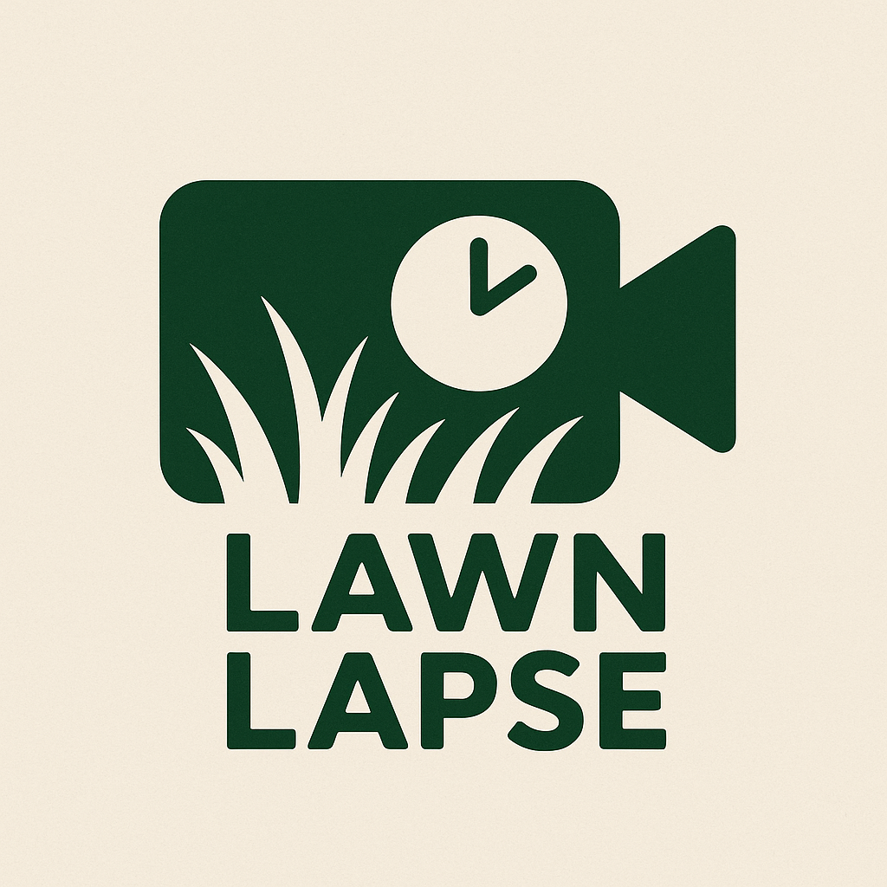

<div align="center">
  

# 🌱 Lawn Lapse

[](https://www.npmjs.com/package/lawn-lapse)
[](https://github.com/dweekly/lawn-lapse/actions/workflows/ci.yml)
[](https://opensource.org/licenses/MIT)
[](https://nodejs.org)

**Automated time-lapse generator for UniFi Protect cameras**

Captures daily snapshots at your chosen time and creates beautiful time-lapse videos showing changes over days, months, or years.

</div>

## 🎬 Demo

Watch your lawn, garden, construction project, or any outdoor space transform over time with automatically generated time-lapse videos.

[](https://youtu.be/2yz4Vk8ADh0)

**[▶️ Watch the demo on YouTube](https://youtu.be/2yz4Vk8ADh0)** - 109 days of lawn evolution captured with 24fps motion interpolation

## ✨ Features

- 📸 **Smart Setup** - Auto-detects configuration and guides through setup on first run
- 🎥 **Multi-Camera Support** - Track multiple cameras with isolated snapshots and timelapses
- 🎬 **Motion Interpolation** - Cinematic 24fps with smooth frame blending for professional results
- 🔄 **Smart Historical Backfill** - Automatically fetches historical footage until recordings run out
- 💾 **Permanent Archive** - Stores snapshots locally forever (beyond NVR retention limits)
- 🔐 **Simple Authentication** - Uses username/password for easy setup
- ⏰ **Advanced Scheduling** - Fixed times, intervals, or sunrise/sunset based captures
- 📊 **Progress Tracking** - Shows detailed progress during snapshot fetching
- 🎯 **Smart Defaults** - Optimized settings out of the box (24fps with interpolation, best quality)

## 📋 Prerequisites

- **Node.js 18+** (required for modern JavaScript features)
- **ffmpeg** installed (`brew install ffmpeg` on macOS, `apt install ffmpeg` on Linux)
- **UniFi Protect** system with at least one camera
- Admin access to UniFi Protect

## 🚀 Quick Start

No installation needed! Just run:

```bash
npx lawn-lapse
```

That's it! The first time you run it, you'll be guided through an interactive setup that will:

1. Connect to your UniFi Protect system
2. Select your camera(s)
3. Fetch historical snapshots (as far back as your NVR has them!)
4. Generate your first time-lapse video

**Want to install it?** You can optionally install globally:

```bash
npm install -g lawn-lapse
lawn  # Now you can just type "lawn"!
```

**For developers:** Clone the repo and run `npm install && npm start`

## 🎯 Usage

### Main Command

```bash
lawn [command]
```

When run without arguments:

- **First run**: Automatically starts interactive setup
- **Subsequent runs**: Captures snapshots and updates time-lapse

### Commands

| Command        | Description                               |
| -------------- | ----------------------------------------- |
| `lawn`         | Run capture (auto-setup if first time)    |
| `lawn status`  | Show configuration and statistics         |
| `lawn cron`    | Set up or update automated daily captures |
| `lawn version` | Show version number                       |
| `lawn help`    | Display help information                  |

### Verbose Mode

Add `-v` or `--verbose` flag for detailed output:

```bash
lawn -v  # Shows ffmpeg output and detailed logging
```

## 🔧 Configuration

### Interactive Setup

On first run, `lawn` will guide you through:

1. **UniFi Protect Connection**
   - Host/IP address (defaults to 192.168.1.1)
   - Username (defaults to admin)
   - Password

2. **Camera Selection**
   - Shows all available cameras with model info
   - Indicates offline cameras
   - Displays resolution capabilities
   - **Multi-camera support**: Select multiple cameras for parallel tracking
   - Each camera gets its own snapshot and timelapse directories

3. **Snapshot Settings**
   - Capture time (24-hour format, defaults to 12:00)
   - Output directories auto-generated per camera (e.g., `./snapshots/front-yard/`)

4. **Automation Setup**
   - Optional cron job installation
   - Automatic daily captures at specified time for all cameras

### Configuration File

Settings are stored in `lawn.config.json`:

```json
{
  "version": 2,
  "unifi": {
    "host": "192.168.1.1",
    "username": "admin",
    "password": "your-password"
  },
  "schedule": {
    "timezone": "America/Los_Angeles",
    "mode": "fixed-time",
    "fixedTimes": ["12:00"]
  },
  "cameras": [
    {
      "id": "abc123",
      "name": "Front Yard",
      "snapshotDir": "./snapshots/front-yard",
      "timelapseDir": "./timelapses/front-yard",
      "video": { "fps": 24, "quality": 1, "interpolate": true }
    },
    {
      "id": "def456",
      "name": "Back Yard",
      "snapshotDir": "./snapshots/back-yard",
      "timelapseDir": "./timelapses/back-yard",
      "video": { "fps": 24, "quality": 1, "interpolate": true }
    }
  ]
}
```

> ⚠️ **Security Note**: Keep `lawn.config.json` secure and never commit it to version control

## 📸 How It Works

### Snapshot Collection

1. **Daily Capture**: At your specified time, captures a frame from the camera
2. **Historical Backfill**: On first run, walks backward through available UniFi recordings until no footage remains
3. **Smart Fetching**: Only downloads missing snapshots, skips existing ones
4. **Progress Display**: Shows `[n/total]` progress for each snapshot

### Time-lapse Generation

1. **Auto-detection**: Finds the highest resolution from your snapshots
2. **Smart Scaling**: Maintains aspect ratio while maximizing quality
3. **Optimized Encoding**: Uses H.264 with slow preset for best compression
4. **Configurable FPS**: Default 24fps with motion interpolation for cinematic smooth playback

### File Organization

```
lawn-lapse/
├── snapshots/              # Per-camera snapshot directories
│   ├── front-yard/
│   │   ├── 2024-01-01_1200.jpg
│   │   ├── 2024-01-02_1200.jpg
│   │   └── ...
│   └── back-yard/
│       ├── 2024-01-01_1200.jpg
│       └── ...
├── timelapses/             # Per-camera timelapse directories
│   ├── front-yard/
│   │   └── timelapse_12h00_2024-01-01_to_2024-03-15.mp4
│   └── back-yard/
│       └── timelapse_12h00_2024-01-01_to_2024-03-15.mp4
├── lawn.config.json        # Project configuration
└── logs/lawn-lapse.log     # Cron job logs
```

## 🔍 Monitoring

### Check Status

```bash
lawn status
```

Shows:

- Total snapshots collected
- Date range of footage
- Gap detection in sequence
- Time-lapse videos generated
- Cron job status
- Last capture time

### Example Output

```
🎥 Lawn Lapse Status Report
============================================================

📷 Cameras (2 configured):
============================================================

📹 Front Yard (abc123)
------------------------------------------------------------
  Snapshots: ./snapshots/front-yard
  Timelapses: ./timelapses/front-yard

  📸 Snapshots: 45 at 12:00
     Range: 2024-01-01 to 2024-02-14
     ✓ No gaps

  🎬 Time-lapses: 1 video(s)
     Latest: timelapse_12h00_2024-01-01_to_2024-02-14.mp4 (8.3MB)
     Covers: 45 days (2024-01-01 to 2024-02-14)

📹 Back Yard (def456)
------------------------------------------------------------
  Snapshots: ./snapshots/back-yard
  Timelapses: ./timelapses/back-yard

  📸 Snapshots: 42 at 12:00
     Range: 2024-01-04 to 2024-02-14
     ✓ No gaps

  🎬 Time-lapses: 1 video(s)
     Latest: timelapse_12h00_2024-01-04_to_2024-02-14.mp4 (7.1MB)
     Covers: 42 days (2024-01-04 to 2024-02-14)

⏰ Cron Job:
  ✓ Active: Daily at 12:00

🔐 Authentication:
  ✓ Credentials configured
  Username: admin

============================================================
📊 Summary:
  ✓ System operational: 2 camera(s), 87 total snapshot(s), 2 time-lapse(s)
```

## 🛠 Troubleshooting

### Common Issues

| Problem                 | Solution                                                                                                 |
| ----------------------- | -------------------------------------------------------------------------------------------------------- |
| "No cameras found"      | Ensure UniFi Protect is accessible and user has admin privileges                                         |
| "Authentication failed" | Check username/password, ensure 2FA is disabled for API access                                           |
| Timeout errors          | Reduce video duration or check network connectivity                                                      |
| Missing snapshots       | Verify camera was online and recording at capture time                                                   |
| Cron not running        | Check cron service is enabled: `sudo launchctl load -w /System/Library/LaunchDaemons/com.vix.cron.plist` |

### Debug Mode

Run with verbose flag for detailed debugging:

```bash
lawn -v
```

### Manual Capture

Force an immediate capture regardless of schedule:

```bash
npm exec lawn
```

## 🤝 Contributing

Contributions are welcome! Please see [CONTRIBUTING.md](CONTRIBUTING.md) for guidelines.

### Development Setup

```bash
# Clone repository
git clone https://github.com/dweekly/lawn-lapse.git
cd lawn-lapse

# Install dependencies
npm install

# Run in development
node lawn-lapse.js -v

# Format code
npm run format

# Lint code
npm run lint
```

## 📝 API Documentation

### Main Functions

The project exports several key functions for programmatic use:

```javascript
import { runSetup, runCapture } from "./lawn-lapse.js";

// Run interactive setup
await runSetup();

// Capture snapshots and generate time-lapse
await runCapture();
```

See [API.md](API.md) for detailed documentation.

## 🔒 Security

- Credentials are stored locally in `lawn.config.json`
- Never commit `lawn.config.json` to version control
- Uses UniFi Protect's official API library
- No external services or telemetry
- All data stays on your local machine

## 📜 License

MIT License - see [LICENSE](LICENSE) file for details

## 🙏 Acknowledgments

- Built with [unifi-protect](https://github.com/hjdhjd/homebridge-unifi-protect) library
- Inspired by traditional time-lapse photography techniques
- Thanks to the UniFi Protect community

## 📧 Support

- **Issues**: [GitHub Issues](https://github.com/dweekly/lawn-lapse/issues)
- **Discussions**: [GitHub Discussions](https://github.com/dweekly/lawn-lapse/discussions)

---

Made with ❤️ for the UniFi Protect community
